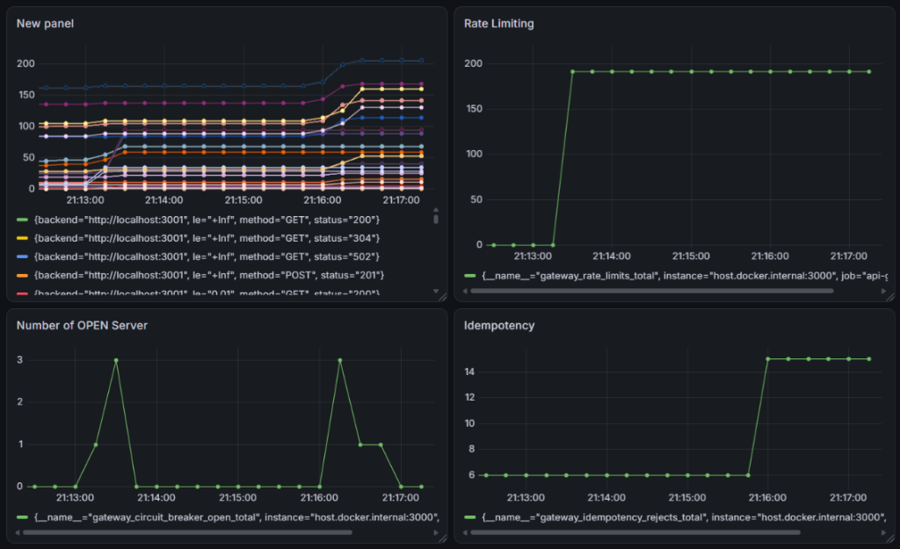

# Resilient API Gateway Architecture

A high-performance, fault-tolerant API Gateway and Distributed Systems testbed built with **Node.js, Fastify, and Redis**.

## Core Architectural Features

- **Adaptive Load Balancing**: Routes traffic dynamically by calculating a real-time score based on node latency (Exponential Moving Average) and in-flight request counts.
- **GCRA Rate Limiting**: Uses a custom Lua script in Redis to implement the Generic Cell Rate Algorithm, providing smooth traffic.
- **Distributed Idempotency (Mutex)**: Utilizes Redis `SET NX EX` locks to mathematically guarantee that duplicate `POST` requests are dropped.
- **Circuit Breakers & Self-Healing**: Automatically isolates dead backend nodes after consecutive failures, and utilizes background synthetic health pings to safely test and reintegrate them once they recover.
- **Real-Time Observability**: A React + Vite Admin Dashboard using WebSockets that displays live network telemetry at 60 frames per second.
- **Time-Series Telemetry (Prometheus & Grafana)**: Fully instrumented with `prom-client` to export Golden Signals (CPU, Memory, Event Loop Lag) and custom business metrics (Rate Limits Enforced, Idempotency Rejects) to a Dockerized monitoring stack.

## Technology Stack
- **Gateway & Backends**: Node.js, Fastify, Undici
- **State & Caching**: Redis (Dockerized), Lua Scripting
- **Dashboards**: React, Vite, TailwindCSS, TanStack Query
- **Observability**: Prometheus, Grafana, Socket.io

---

## How to Run Locally

### 1. Start the Container (Redis, Prometheus, Grafana)
```bash
docker compose up -d
```

### 2. Install Dependencies
```bash
npm install
```

### 3. Start the Backend Cluster & API Gateway
Run these in two separate terminals:
```bash
npm run start:backends

npm run start:gateway
```

### 4. Start the UIs
Open two more terminals to run the Web Apps:
```bash
npm run dev --workspace=packages/admin-dashboard

npm run dev --workspace=packages/client-app
```

---

## Chaos Engineering & Testing

A Chaos script that simulates large traffic triggering rate limits and random catastrophic node failures.

While everything is running, execute:
```bash
node chaos-test.js
```

## Viewing Metrics in Grafana

1. Open Grafana at [http://localhost:3005](http://localhost:3005) (Login: `admin` / `admin`).
2. Add a **Prometheus** Data Source with the URL `http://prometheus:9090`.
3. Create dashboards using PromQL to query your custom metrics:
   - `gateway_request_duration_seconds_bucket`
   - `gateway_rate_limits_total`
   - `gateway_circuit_breaker_open_total`
   - `gateway_idempotency_rejects_total`
